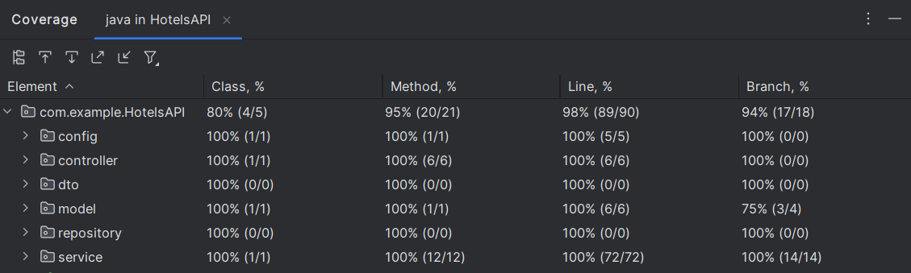

# 🏨 HotelAPI - RESTful Hotel Management Service


## 📖 Overview
HotelAPI is a comprehensive RESTful service for managing hotel information, developed as a test case for GP Solutions using Spring Boot. The API provides full CRUD operations for hotels with advanced search and analytics capabilities.

## 🌟 Features
- Complete hotel management system
- Advanced search with multiple filters
- Amenity management for hotels
- Analytical endpoints for data visualization
- 100% test coverage on service layer
- Swagger API documentation
- Configurable database support

## 🚀 API Endpoints

### 🔍 Hotel Operations
| Method | Endpoint | Description |
|--------|----------|-------------|
| `GET` | `/property-view/hotels` | Get all hotels |
| `GET` | `/property-view/hotels/{id}` | Get hotel by ID |
| `POST` | `/property-view/hotels` | Create new hotel |
| `POST` | `/property-view/hotels/{id}/amenities` | Add amenities to hotel |

### 🔎 Search & Analytics
| Method | Endpoint | Description |
|--------|----------|-------------|
| `GET` | `/property-view/search` | Search hotels with filters |
| `GET` | `/property-view/histogram/{param}` | Get histogram data by parameter |

### 🛠️Tests
The service layer of the "Hotel-App" application has **100% unit test coverage**. This means that every method and code path in the service layer is thoroughly tested, ensuring the correctness of the application's core functionality.



## 🔍Swagger API Documentation
The project includes Swagger integration via the Springdoc OpenAPI library. Once the application is running, you can access the interactive Swagger UI at the following URL:
```
http://localhost:8092/swagger-ui.html
```
Swagger provides a convenient interface for testing API endpoints directly from the browser, along with automatic documentation of request parameters and responses.

## 🛠️ Installation

### Prerequisites
- JDK 21+
- Maven 3.9.6+

### Quick Start
```bash
git clone https://github.com/kirshunya/HotelAPI.git
cd HotelAPI
mvn spring-boot:run